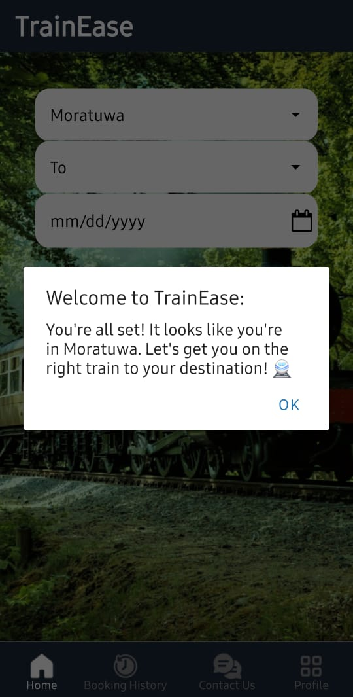
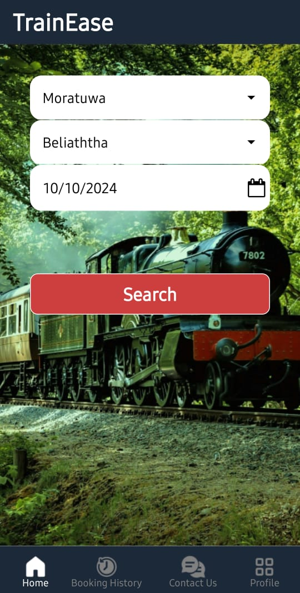
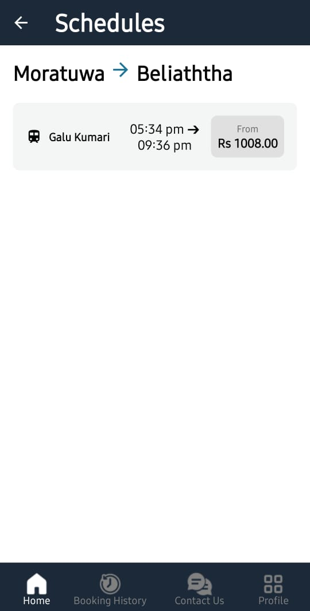
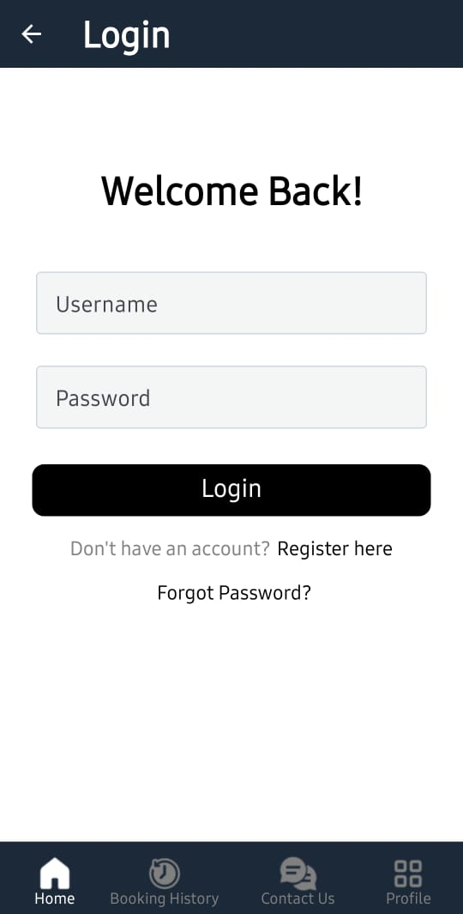
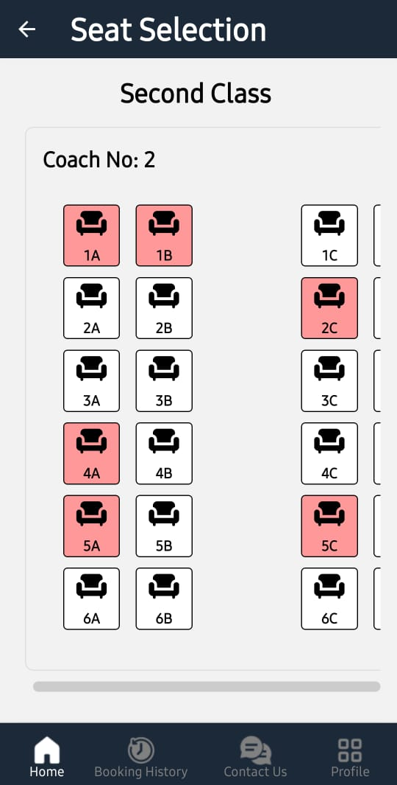
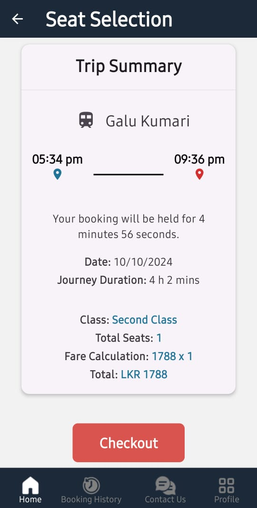
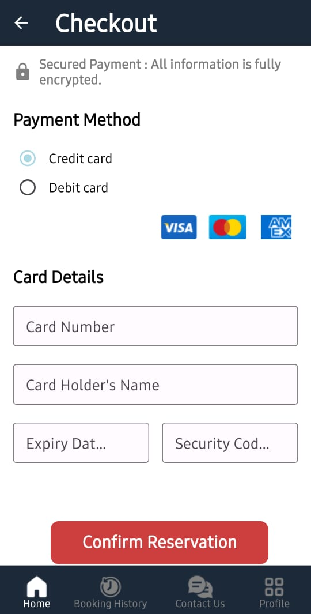
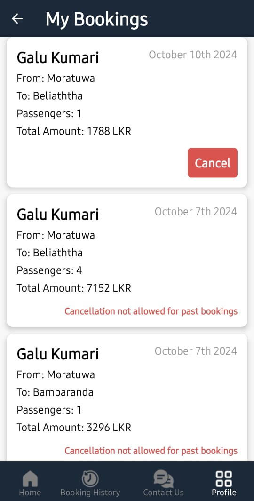
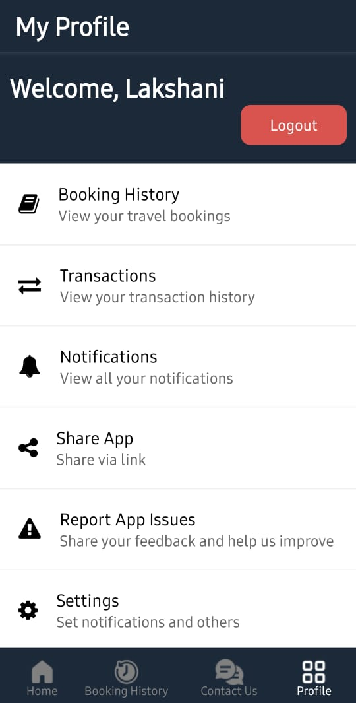

# TrainEase - Train Booking Mobile App

TrainEase is a modern mobile app that allows users to search for trains, book tickets, manage their profile, and receive notifications for bookings or updates. The app includes features like location-based suggestions, a chatbot for customer support, and supports both light and dark themes.

## Screenshots of the TrainEase Mobile App

<div style="display: flex; flex-wrap: wrap; justify-content: space-around;">
    
   
    
    
    
    
    
    
    
    
</div>

## Features

- **Train Search**: Search for trains by selecting the source and destination stations, along with the desired date and time.
- **Location-Based Search**: Automatically sets the current city as the source station using geolocation.
- **Seat Booking**: Select and book seats in different coach classes.
- **Booking History**: View past and upcoming bookings, with options to cancel and sort by time.
- **Notifications**: Receive push notifications for booking confirmations, cancellations, and updates.
- **Chatbot**: A chatbot integrated to assist users with understanding support.
- **Dark Mode**: Support for light and dark themes, dynamically changing based on user preferences.
- **Profile Management**: Update user profile, view booking history, and manage notifications.
- **Issue Reporting**: Users can report issues directly through the app.
- **Payment Processing**: Secure and easy payments for bookings using Stripe API.

## Tech Stack

- **React Native**: The app is built using React Native for cross-platform functionality on both iOS and Android.
- **Redux**: For state management.
- **Expo SDK 49**: The app uses Expo for easier development and deployment.
- **Notifications**: Implemented using `expo-notifications`.
- **Location Services**: Geolocation is handled using `expo-location`.
- **Axios**: For API calls.


## Prerequisites

- Node.js (v14 or above)
- Expo CLI (`npm install -g expo-cli`)
- Yarn (Optional, for dependency management)
- Expo Go (for testing on mobile)

## Installation
1. Clone the repository:

    ```bash
   git clone https://github.com/LRManamperi/TrainEase-Mobile.git
    
2. Install the dependencies:

    ```bash
    yarn install
    OR
   npm install
3. Create an .env file to store environment variables:

    ```bash
   BASE_URL=http://your-ipv4-address:port
4. Start the Expo development server:

    ```
    expo start
5. Running on Mobile Device:

    ```bash
    Download the Expo Go app from Google Play Store or Apple App Store.Scan the QR code generated in your terminal after running expo start to view the app on your device.


## Testing

We use Jest for unit testing the app's functionality. You can run tests using:
```
npm test 
```

We use Cypress for User Interface testing. You can run tests using:

```
npx cypress run
```


We use K6 for load testing the app's functionality. You can run tests using:
```
k6 run script.js
```

## Deployment

We build our app using Expo:

```
eas build --platform ios/android
```
## Contribution

Contributions are welcome! If you find a bug or want to suggest a feature, feel free to open an issue or submit a pull request.

